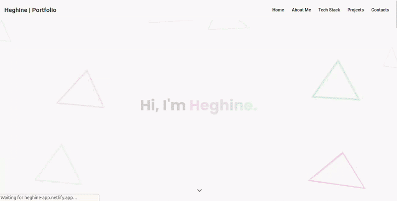

## Hi, I'm Heghine 👋

Full-stack developer focused on **interactive UIs, real-time systems, and clean architecture**.
I build interfaces that feel alive — and systems that stay understandable as they grow.

JavaScript, TypeScript, Angular, Node.js, and more.

🚀 Currently open to freelance projects and collaborations.

### What I Do

<!--
- Build animated, responsive user interfaces for websites and web apps.
- Develop real-time functionality for chats, dashboards, and collaborative tools.
- Design full-stack architectures for projects that grow beyond "just a frontend".
- Integrate authentication, APIs, databases, and deployment workflows.
- Maintain strong structural consistency across UI, state, APIs, and design.
- Optimize performance and apply unit and end-to-end testing where it matters.
-->

- I build fast, modern websites and web applications that help businesses attract and retain users.
- I develop custom dashboards, booking systems, and real-time features when off-the-shelf tools aren't enough.
- I design scalable backend systems so projects don’t break when they grow.
- I handle authentication, APIs, databases, and deployment — end to end.
- I improve performance and stability so your application stays reliable.

### Current Focus

- Writing about programming, tooling, and DX issues encountered in practice.
- Publishing technical breakdowns, fixes, and implementation notes.
- Exploring independent projects and collaborations across web.

### Tech Stack

**Frontend**
Angular • RxJS • SCSS / Tailwind • Angular Material
React • Next.js • JSX / TSX
Custom SVG & canvas animations • Three.js

**Backend**
Node.js • TypeScript • NestJS • Express
REST & GraphQL APIs • WebSockets • Socket.io
Authentication (JWT, Passport.js)

**Data**
PostgreSQL • MongoDB • Redis
Prisma • TypeORM • Mongoose • Sequelize

**Testing, Performance & Quality**
Cypress • Jest • Jasmine • Karma • Mocha • Chai • LightHouseCI • Clinic.js • Artillery

### Selected projects

**Animated Portfolio**
Fully responsive Angular portfolio with custom interactions.

- SVG-based background animations.
- Drag-and-drop UI.
- Multiple visual themes.

**Real-time Chat Application**
A full-stack real-time app with authentication and live messaging.

- JWT-based auth.
- Socket.io & Redis.
- Angular frontend.

I prefer fewer tools used deeply over many tools used shallowly.
Structure matters to me — in code, design, and systems.

And yes, I like cats 🐈

📫 **Links**

- LinkedIn: https://www.linkedin.com/in/heghine-avetisyan-650291384/
- Portfolio: https://heghine-app.netlify.app/
- Dev-Notes (A repository that contains my notes and tutorials.): https://github.com/ZeroaNinea/Dev-Notes
