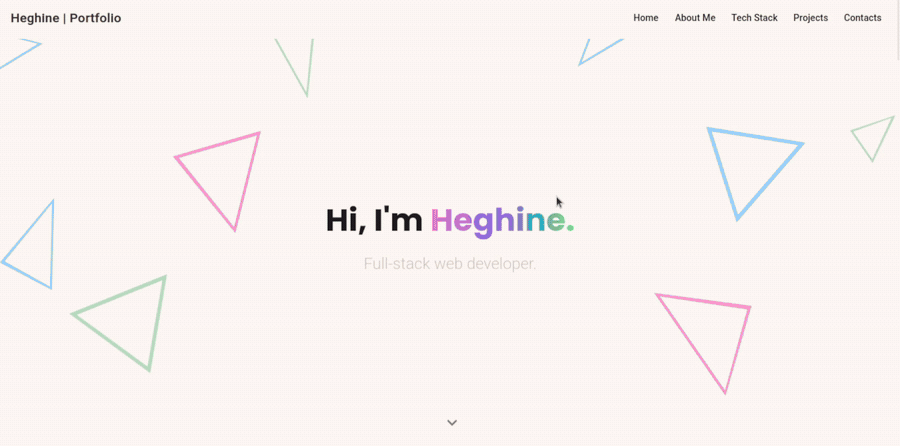
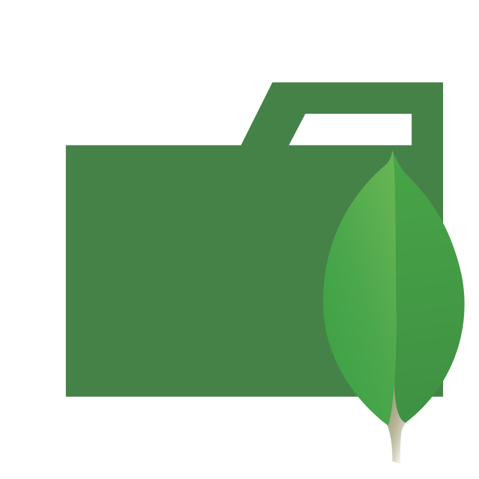

# Hi, I'm Heghine 👋

A full-stack developer focused on JavaScript-related technologies. I'm a very silly gal. And constantly use GIFs with cats. I have a bunch of skills, but I'll never get employed because of my silliness.

If you contact me, I'll probably send you a GIF of a cat.
 
\>:3

## Tech Stack

I'm mainly focused in JavaScript development. My tech stack includes these frameworks, Libraries and running environment: Angular, React, React Native, Next.js, Vue.js, Nest.js and Node.js. I'm confident in both frontend and backend, and in all corresponding technologies — Authentication, APIs and testing.

<table>
  <tr>
    <td align="center"><b>Frontend</b></td>
    <td align="center"><b>Backend</b></td>
    <td align="center"><b>Data</b></td>
    <td align="center"><b>Testing, Performance & Quality</b></td>
  </tr>
  <tr>
    <td>Angular </td>
    <td>Passport.js </td>
    <td>PostgreSQL </td>
    <td>Cypress </td>
  </tr>
  <tr>
    <td>RxJS </td>
    <td>Sanity.io </td>
    <td>MongoDB </td>
    <td>Jest </td>
  </tr>
  <tr>
    <td>NgRx </td>
    <td>NestJS </td>
    <td>Redis </td>
    <td>Jasmine </td>
  </tr>
  <tr>
    <td>SCSS </td>
    <td>Express.js </td>
    <td>Prisma </td>
    <td>Karma </td>
  </tr>
  <tr>
    <td>Tailwind </td>
    <td>REST & GraphQL APIs</td>
    <td>TypeORM </td>
    <td>Mocha </td>
  </tr>
  <tr>
    <td>Angular Material </td>
    <td>WebSockets </td>
    <td>Mongoose </td>
    <td>Chai </td>
  </tr>
  <tr>
    <td>React </td>
    <td>Socket.io </td>
    <td>Sequelize </td>
    <td>LightHouseCI </td>
  </tr>
  <tr>
    <td>Zustand </td>
    <td>0Auth2</td>
    <td>MySQL </td>
    <td>Artillery </td>
  </tr>
  <tr>
    <td>React Native </td>
    <td>JWT </td>
    <td>SQLite </td>
    <td>Clinic.js </td>
  </tr>
  <tr>
    <td colspan="2" align="center">Next.js </td>
    <!-- <td>Passport.js </td> -->
    <td>MariaDB </td>
    <td>-</td>
  </tr>
  <tr>
    <td colspan="2" align="center">Node.js </td>
    <td>MongoDB in Memory Server </td>
    <td>-</td>
  </tr>
  <tr>
    <td>TSX /JSX </td>
    <td>Auth0 </td>
    <td>-</td>
    <td>-</td>
  </tr>
  <tr>
    <td>Vue.js </td>
    <td>-</td>
    <td>-</td>
    <td>-</td>
  </tr>
  <tr>
    <td>Pinia </td>
    <td>-</td>
    <td>-</td>
    <td>-</td>
  </tr>
  <tr>
    <td>Custom SVG & canvas animations</td>
    <td>-</td>
    <td>-</td>
    <td>-</td>
  </tr>
  <tr>
    <td>Three.js </td>
    <td>-</td>
    <td>-</td>
    <td>-</td>
  </tr>
  <tr>
    <td>HTML /CSS </td>
    <td>-</td>
    <td>-</td>
    <td>-</td>
  </tr>
  <tr>
    <td colspan="2" align="center">JavaScript /TypeScript </td>
    <!-- <td>-</td> -->
    <td>-</td>
    <td>-</td>
  </tr>
  <tr>
    <td>Bootstrap </td>
    <td>-</td>
    <td>-</td>
    <td>-</td>
  </tr>
</table>

## Niche

I build interactive web applications and internal systems using JavaScript and TypeScript.

My work typically involves:

## Current Focus

- Expanding into the React ecosystem (Redux, Testing Library);
- Building reusable UI systems;
- Finding freelance clients and collaborations.

## Selected Projects

### Portfolio Site

🔗 Live: [https://heghine-app.netlify.app/](https://heghine-app.netlify.app/)
🔗 Source: [https://github.com/ZeroaNinea/Site-Portfolio](https://github.com/ZeroaNinea/Site-Portfolio)

Interactive portfolio built with Angular, focused on custom UI, motion, and visual systems.

### Real-time Chat Application

🔗 Live: [https://real-time-chat-app-great-bulbdog.vercel.app/](https://real-time-chat-app-great-bulbdog.vercel.app/)
🔗 Source: [https://github.com/ZeroaNinea/Real-Time-Chat-App](https://github.com/ZeroaNinea/Real-Time-Chat-App)

Discord-like full-stack chat application with authentication and real-time messaging.

### Command Palette (Angular)

🔗 Live: [https://zeroaninea.github.io/Command-Palette-Angular/](https://zeroaninea.github.io/Command-Palette-Angular/)
🔗 Source: [https://github.com/ZeroaNinea/Command-Palette-Angular](https://github.com/ZeroaNinea/Command-Palette-Angular)

Reusable command palette with dynamic theming and keyboard navigation.

### Animated Modal Window (React)

🔗 Live: [https://zeroaninea.github.io/Modal-Window-Vite-React-Tailwind/](https://zeroaninea.github.io/Modal-Window-Vite-React-Tailwind/) 🔗 Source: [https://github.com/ZeroaNinea/Modal-Window-Vite-React-Tailwind](https://github.com/ZeroaNinea/Modal-Window-Vite-React-Tailwind)

Reusable animated modal component built with React, Vite, and Tailwind.

## 📫 Links

- LinkedIn: https://www.linkedin.com/in/heghine-avetisyan-650291384/
- Portfolio: https://heghine-app.netlify.app/
- Dev-Notes (A repository that contains my notes and tutorials.): https://github.com/ZeroaNinea/Dev-Notes
- Medium: https://medium.com/@heghine.dev357
- Dev.to: https://dev.to/zeroaninea_8bec34a4e7d029
