# Hi, I'm Heghine 👋

Full-stack developer focused on **interactive UIs, real-time systems, and clean architecture**.
I build interfaces that feel alive — and systems that stay understandable as they grow.

JavaScript, TypeScript, Angular, Node.js, and more.

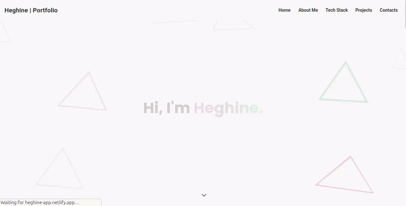

## Tech Stack

I'm mainly focused in JavaScript development. My tech stack includes these frameworks, Libraries and running environment: Angular, React, React Native, Next.js, Vue.js, Nest.js and Node.js. I'm confident in both frontend and backend, and in all corresponding technologies — Authentication, APIs and testing.

<table>
  <tr>
    <td><b>Frontend</b></td>
    <td><b>Backend</b></td>
    <td><b>Data</b></td>
    <td><b>Testing, Performance & Quality</b></td>
  </tr>
  <tr>
    <td>Angular </td>
    <td>Node.js </td>
    <td>PostgreSQL</td>
    <td>Cypress </td>
  </tr>
  <tr>
    <td>RxJS 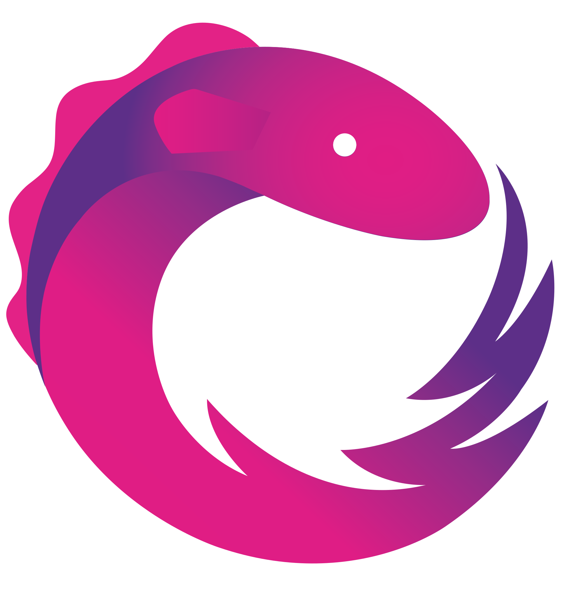</td>
    <td>TypeScript /JavaScript </td>
    <td>MongoDB</td>
    <td>Jest </td>
  </tr>
  <tr>
    <td>NgRx 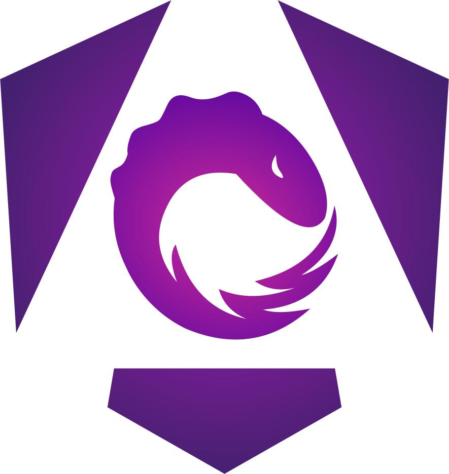</td>
    <td>NestJS </td>
    <td>Redis </td>
    <td>Jasmine </td>
  </tr>
  <tr>
    <td>SCSS </td>
    <td>Express.js </td>
    <td>Prisma </td>
    <td>Karma </td>
  </tr>
  <tr>
    <td>Tailwind 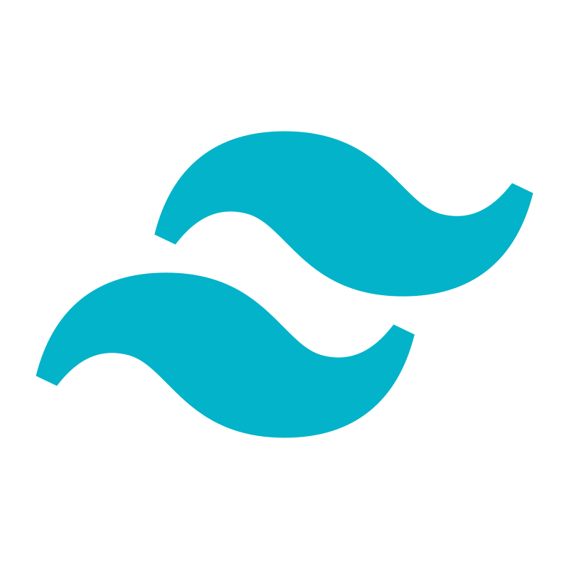</td>
    <td>REST & GraphQL APIs</td>
    <td>TypeORM </td>
    <td>Mocha 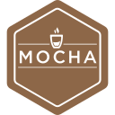</td>
  </tr>
  <tr>
    <td>Angular Material </td>
    <td>WebSockets </td>
    <td>Mongoose </td>
    <td>Chai </td>
  </tr>
  <tr>
    <td>React </td>
    <td>Socket.io </td>
    <td>Sequelize </td>
    <td>LightHouseCI 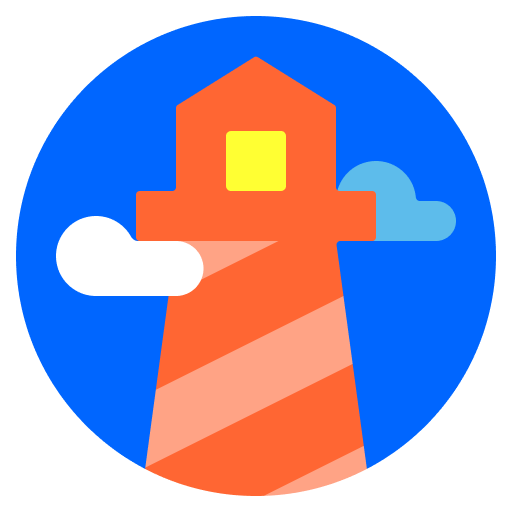</td>
  </tr>
  <tr>
    <td>Zustand </td>
    <td>0Auth2</td>
    <td>MySQL</td>
    <td>Artillery </td>
  </tr>
  <tr>
    <td>React Native </td>
    <td>JWT </td>
    <td>SQLite</td>
    <td>Clinic.js 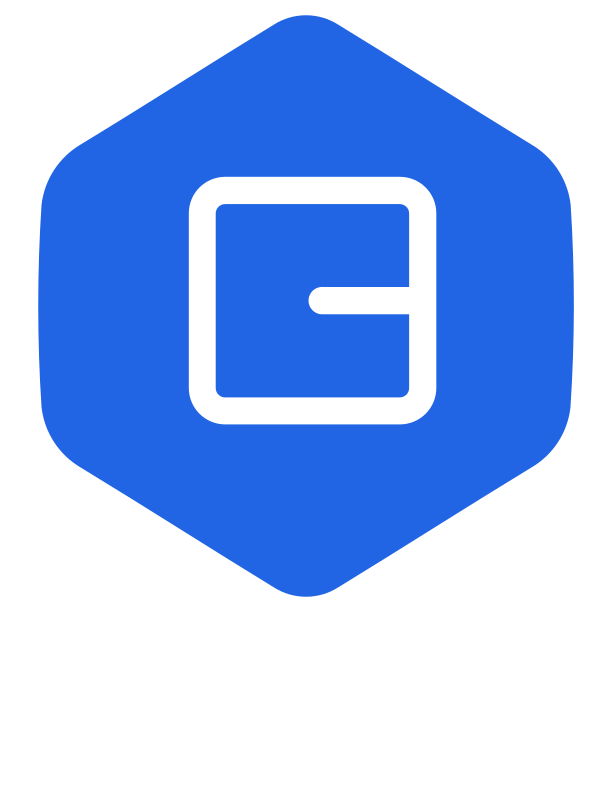</td>
  </tr>
  <tr>
    <td>Next.js </td>
    <td>Passport.js 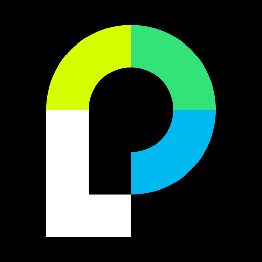</td>
    <td>MariaDB</td>
    <td>-</td>
  </tr>
  <tr>
    <td>TSX /JSX </td>
    <td>Sanity.io 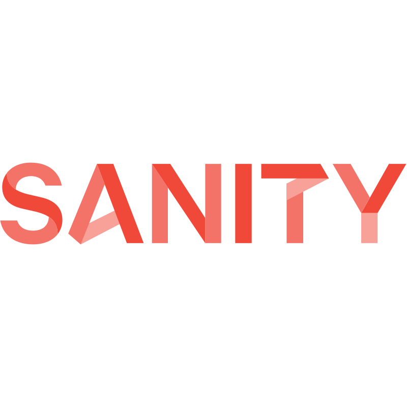</td>
    <td>-</td>
    <td>-</td>
  </tr>
  <tr>
    <td>Vue.js 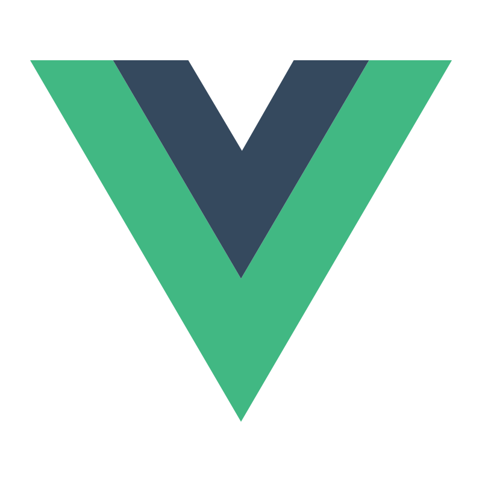</td>
    <td>-</td>
    <td>-</td>
    <td>-</td>
  </tr>
  <tr>
    <td>Pinia </td>
    <td>-</td>
    <td>-</td>
    <td>-</td>
  </tr>
  <tr>
    <td>Custom SVG & canvas animations</td>
    <td>-</td>
    <td>-</td>
    <td>-</td>
  </tr>
  <tr>
    <td>Three.js </td>
    <td>-</td>
    <td>-</td>
    <td>-</td>
  </tr>
  <tr>
    <td>HTML /CSS 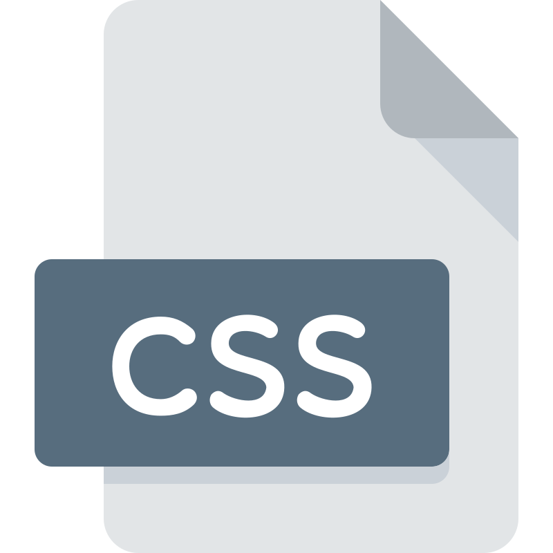</td>
    <td>-</td>
    <td>-</td>
    <td>-</td>
  </tr>
  <tr>
    <td>JavaScript /TypeScript </td>
    <td>-</td>
    <td>-</td>
    <td>-</td>
  </tr>
</table>

## Niche

I build interactive web applications and internal systems using JavaScript and TypeScript.

My work typically involves:

## Current Focus

- Extendisg my stack. The nearest plans are learning, Redux, React Testing Library, and .NET.
- Finding freelance clients.
- Searching for new colaborations.

### Selected projects

**Animated Portfolio**
Fully responsive Angular portfolio with custom interactions.

- SVG-based background animations.
- Drag-and-drop UI.
- Multiple visual themes.

**Real-time Chat Application**
A full-stack real-time app with authentication and live messaging: https://github.com/ZeroaNinea/Real-Time-Chat-App

- JWT-based auth.
- Socket.io & Redis.
- Angular frontend.

Structure matters to me — in code, design, and systems.

And yes, I like cats 🐈

📫 **Links**

- LinkedIn: https://www.linkedin.com/in/heghine-avetisyan-650291384/
- Portfolio: https://heghine-app.netlify.app/
- Dev-Notes (A repository that contains my notes and tutorials.): https://github.com/ZeroaNinea/Dev-Notes
- Medium: https://medium.com/@heghine.dev357
- Dev.to: https://dev.to/zeroaninea_8bec34a4e7d029
